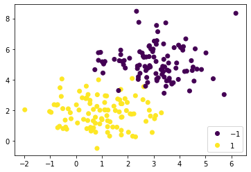
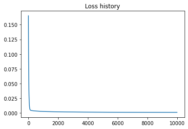
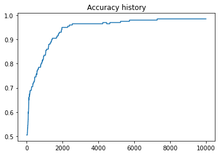
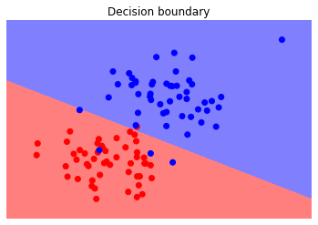

<h1 align="center">Creating a simple neural network from scratch</h1>

## Description
This is the first part of a series of projects that will eventually end in a self made library to build neural networks with a variety of layers so that I will be able to have a neural network that solves MNIST or even more complicated problems. But first I start at the very beginning, a single layer linear neural network that solves a simple classification problem. 

Next I will list the steps we will go trough:
1. Generating simple toy data
2. Looking at some math and implementing the model
3. Defining a function that computes the loss
4. Using gradient descent and a learning rate
5. Training our model
6. Computing the accuracy of our model and tweaking it
7. Testing the model on test data


## Generating Toy Data
Let's start by having a look at the data and the problem we want to solve. Therefore I generate two bivariat normal distributed point clouds X1 and X2 and give each of them a label stored in y.

``` bash
import numpy as np

def generate_data(n):
    X1 = np.random.multivariate_normal([1,2], [[1,0], [0,1]], int(n/2))
    X2 = np.random.multivariate_normal([3,5], [[1,0], [0,1]], int(n/2))
    X = np.concatenate((X1, X2))
    y = np.concatenate((np.ones(int(n/2)), -np.ones(int(n/2))))
    return X, y

X_train, y_train = generate_data(200)
X_test, y_test = generate_data(100)

plt.scatter(X_train[:,0], X_train[:,1], c=y_train)
scatter = plt.scatter(X_test[:,0], X_test[:,1], c=y_test)
plt.legend(*scatter.legend_elements(), loc=4)
plt.show()
```
<p align="center"> 
    
</p>
Now the goal is to teach our network to separate the two clusters with a straight line as good as possible

## Implementing the Neural Network

I am assuming you have a first semester level of calculus and linear algebra and know python and numpy. We will start very simple. To reach our goal we need to teach our model a linear graph. We know that a line in a coordinate system is defined as y = x * w + b with x being the input, y the output, w the weight and b the bias. Since the x is given we need to find the right w and b. So thats what the neural net will learn. 
Now the question is how it will learn w and b. The short answer is: by looking at example points that are labeled. Therefore we will initialise w and b somewhat randomly and give the model a way to tweak them after each training sample point. 
Let's start by defining our neural network as a class and initialise w and b and defining the y or output as we will call it. Note that we have the training data X_train given as a 200x2 matrix (200 points in a 2 dimensional Space). That's why we need to make w a vector of size 2x1.

```bash
class linearNet:
    
    def __init__(self, d):
        self.w = np.random.normal(scale = np.sqrt(d), size=(d,1))
        self.b = 0

    def output(self, X):
        return X @ self.w + self.b
```
## Defining a loss function

This network needs to know now how to adjust w and b. After every time it calculates an output from the training data we will calculate the error to the true labels also known as loss. You probably have heard of the popular mean squared error (mse). If not pause and google it to understand the idea behind it. Basically we calculate error = mean((true_lables - predicted_labels)^2). The predicted_lables are our output. In python it looks like

```bash
def mse(y_true, output):
    return np.mean(np.power(output-y_true, 2))
```

I already worked on other loss functions to get a better performance and understanding for the network. The hinge loss is already added to the code file with all the losses and can easily be exchanged. I will add more loss functions later and add explainations for them here.

## Using gradient descent

We will use a type of gradient descent called **batch gradient descent**. That means all the training data is taken into consideration to adjust w and b. We take the average of the gradients of all the training examples and then use that mean gradient to update our parameters. That way we get just one step of gradient descent in one epoch. If we had a huge dataset, we would need to compute all the data to take just one step. That is very inefficient. So for simplicity sake I will use batch gradient descent but I wouldn't recommend it for every dataset/ml-problem.

Quick recap, we know how far away our output, the predicted labels, are from the true labels. To make use of this information and change w and b to have a better prediction we use gradient descent. That means we calculate the derivative of our loss function with respect to w and b. The two derivatives are now called gradient. (Note: When we have multiple derivatives of one function, they are called a gradient). 
Let's have a look at the math and then translate the results into code.
Note that the output is y_hat and the mse is e.

<p align="center"> 
    
</p>

The last to equations of the math above are our gradients. We will define the derivative of the mse separately, which is only 2*(output - y_true) and take the mean for grad_w (= de/dw) and grad_b (= de/db) separately. Note that in the above definitions we are only considering a single output node. That is there is one output per sample.
But because we use **batch** gradient descent we have more than one output node (multiple outputs) for a given input. In that case we have to average the squared error over the samples but also over the number of output nodes.

```bash
def mse(y_true, output):
    return np.mean(np.power(output-y_true, 2))/y_true.size

def dmse(y_true, output):
    return 2*(output-y_true)/y_true.size
```
and the gradients are
```bash
grad_w = (dloss * X).mean(axis=0).reshape(-1,1)
grad_b = dloss.mean()
```

Note that I ignored the np.mean. You will see why in the next part.

We will add the gradient python function to our linearNet class:
The inputs are X (later it is our training data) the true labels of this data  and the derivative of our loss function.
What are we doing here now in detail? 
First we calculate the labels based on our current w and b.
Then we reshape the true labels so that the shapes match and we don't get a broadcasting error in the dloss_function calculation.
Next we calculate the derivative of the loss function at these values.
Lastly we use it to calculate the gradients of w and b. Here you see why we didn't include the mean in the dloss_function.


```bash
def grad(self, X, y_true, dloss_function):
    output = self.output(X)
    y_true = y_true.reshape(-1,1)
    dloss = dloss_function(y_true, output)

    grad_w = (dloss * X).mean(axis=0).reshape(-1,1)
    grad_b = dloss.mean()

    return grad_w, grad_b
```

This was the most complicated Part. Now we just need to take these two values to adjust the current w and b
We take our w and b of the Neural Network and subtract the grad_w and grad_b fom it, but before we can enhance or weaken the impact of the gradients with the learning rate. With different learning rates you might find different minima, there is no real way of knowing for certain what the best value for the learning rate is to find the global minima. I encourage you to copy the code an play around with it and try different values.

```bash
w -= learning_rate * grad_w
b -= learning_rate * grad_b
```
## Training the model

Let's finish our model by defining a fit function that trains the model and takes all the relevant inputs like the network,the loss and derivative, the learning rate and how many epochs you want to go through the data. Then our final model looks like that

```bash
class linearNet:
    
    def __init__(self, d):
        self.w = np.random.normal(scale = np.sqrt(d), size=(d,1))
        self.b = 0

    def output(self, X):
        return X @ self.w + self.b

    def grad(self, X, y_true, dloss_function):
        output = self.output(X)
        y_true = y_true.reshape(-1,1)
        dloss = dloss_function(y_true, output)

        grad_w = (dloss * X).mean(axis=0).reshape(-1,1)
        grad_b = dloss.mean()

        return grad_w, grad_b
    
    def fit(self, network, X_train, y_train, epochs, learning_rate, loss_function, dloss_function):
        loss_hist = []
        accuracy_hist = []

        for i in range(epochs):
            grad_w, grad_b = net.grad(X_train, y_train, dloss_function)

            network.w -= learning_rate * grad_w
            network.b -= learning_rate * grad_b
```

Finally we can train the model

```bash
net = linearNet(2) #2 input nodes because we have 2 dimensional inputs
net.fit(net, X_train, y_train, epochs=10000, learning_rate=0.1, loss_function=mse, dloss_function=dmse)
```
Let's see what loss we get
<p align="center"> 
    
</p>

```bash
Most recent loss is 0.0011624983493338035
```

That looks great, our loss is steadily going down, that means we approach some minima in our gradient descent. 

## Computing the accuracy

To get the accuracy we can compare the output labels and the true labels. That is very easily done in the following way
```bash
def compute_accuracy(y_true, output): 
    y_pred = np.sign(output) #negative values will be labeled -1 and positive ones 1
    return (y_true == y_pred).mean()
```
For our model we get the following accuracy
<p align="center"> 
    
</p>

```bash
Most recent accuracy is 97.0%
```
Awesome, we only classify 3% of our 200 trainings points wrongly. That means only 6 Points. Since we have non separateable clusters and know it is therefore impossible to get 100% accuracy, the result is great.

## Testing the model

Now we test our model on the test data and see how it does. We use our trained neural network we called "net" and let it return the output for the test data.
```bash
test_output = net.output(X_test)[:,0]
print("The accuracy on test data is "+str(compute_accuracy(y_test, test_output)*100)+"%")
```
and we get 
```bash
The accuracy on test data is 98.0%
```
Wow, that's even better than on the training data which is very unusual. We got lucky with the generated points here. Most often the model will perform slightly worse on the test data than on the training data.
Because I like to visualize results, let's see how it decided wich test points belong to what class:
<p align="center"> 
    
</p>
The test points are colored in their true label color, so you see which ones got classified wrongly.

Here you see how certain it was. The lighter the color the more uncertain the model is with the decision to give the point that label:
<p align="center"> 
    
</p>

You might wonder how I created these plots. I used matplotlib.pyplot and calculated the losses and accuracy every epoch to eventually get a list with all the values to put them into a plot. The decision boundary and contour plot are more complex but if you know how to create and use a meshgrid it should be easy to understand. All the code can be found [here](https://github.com/floriankark/Simple-neural-network-from-scratch-with-just-numpy-and-math/tree/main/code)
